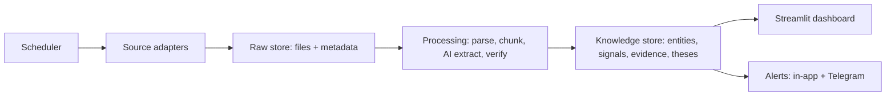

# Architecture

How Pramana's parts fit together (the app was called Mosaic India until 26 Sep 2026). Updated at the end of every milestone.

**Status: Milestone 3 (AI extraction) built on `experiment`; golden-set score pending.** Built so far:
- the company master, from NSE's and BSE's lists, which you upload yourself
- the watchlist
- delayed prices from Yahoo
- filings from the exchanges' official RSS feeds: announcements, shareholding and pledges,
  insider and SAST disclosures
- bulk and block deals from NSE's daily files
- the raw document store, with versions and corrections
- the Command Center, Company, Document Viewer and Data Health pages
- the AI pipeline (brief Section 6), the Signal Feed and Needs review pages, and the golden
  test-set harness

Angel One live prices will be added when the owner's API keys are ready.

## The big picture (from the brief, Section 8)

Built so far:
- **Adapters:** NSE and BSE list parsers, Yahoo prices, four filings adapters.
- **Raw store:** every file as received, versioned.
- **Parsing by code:** feed items, shareholding XBRL, deal files. No AI.
- **Knowledge store:** companies, watchlist, prices, filings, shareholding, deals, conflicts.
- **Scheduler** and **dashboard.**

## What happens when you run `start.py`

1. **Python check.** It stops with a plain-English message if Python is older than 3.11.
2. **Private package folder.** It creates `.venv/` in the project and installs
   `requirements.txt` into it. It only reinstalls when `requirements.txt` changes (a fingerprint
   is stored in `.venv/mosaic-requirements.sha256`). This keeps the app separate from other
   Python software on the computer and avoids the macOS "externally managed environment" error.
3. **Relaunch.** It runs itself again using the `.venv` Python.
4. **Keys file.** It copies `.env.example` to `.env` if `.env` doesn't exist. It never
   overwrites an existing `.env`.
5. **Settings and database.** It loads `config.yaml`, then creates `data/mosaic.db` and
   `data/raw/` if missing. This is safe to repeat.
6. **Scheduler.** It starts `python -m app.scheduler` in the background (log: `logs/scheduler.log`).
   The scheduler:
   - refreshes prices every 15 minutes in market hours and at 15:45;
   - ticks every 5 minutes to check whichever exchange feeds are due
     (`app/services/schedule.py`);
   - fetches bulk and block deals at 18:30 on weekdays.

   On start it reads every feed once.
7. **Dashboard.** It starts Streamlit (`streamlit_app.py`) in the background on the first free port from 8501,
   waits until it answers, then opens the browser. Streamlit's own output goes to
   `logs/dashboard.log`.

Any failure becomes a **PROBLEM / WHAT TO DO** message.

## Streamlit entrypoint (works with or without `start.py`)

`streamlit_app.py` is the one Streamlit entrypoint. It's used by `start.py`, by a plain
`streamlit run streamlit_app.py`, and by Streamlit Community Cloud.

1. It sets up the page and styling.
2. It calls `app/bootstrap.ensure_ready()`, which loads `.env` if present, sets up logging and
   creates the database. This is cached with `st.cache_resource`, so it runs once per database.
3. It registers pages with `st.navigation`, grouped into sidebar sections ("Research",
   "Setup"). Each screen is a file in `app/ui/`; new screens are added to the `pages` dict.
4. It draws the sidebar extras (upcoming screens, market-hours card) and the footer.

## Look and feel (Pramana design, 26 Sep 2026)

- **Theme:** `.streamlit/config.toml` sets a light theme with a blue palette
  (#03045E, #0077B6, #00B4D8, #90E0EF, #CAF0F8), rounded corners and the Inter / JetBrains Mono
  fonts. The fonts load from Google Fonts in the browser; offline, the system font is used.
- **Shared styling:** `app/ui/common.py` holds the CSS and small HTML helpers: cards
  (`st.container(border=True, key="card-...")`), `card_head`, `tag`, `fresh`, `kpi`,
  `sparkline`, `gauge`, `empty_state`. They only display values from `app/services`; a missing
  value shows "Unknown" or an empty state.
- **Charts:** `app/ui/charts.py` (Altair). Shareholding is drawn as separate lines, never
  stacked, because "Public (total)" already includes the institutions.
- **Colour means something:** green/red only for up/down, amber only for stale or needing a
  look, red for errors. Everything else is blue or grey.
- **Logo:** `app/ui/assets/logo.svg` and `icon.svg`.

**Keys:** `app/keys.get_key(name)` reads the environment and `.env` first, then Streamlit
secrets (`.streamlit/secrets.toml` locally, or the Secrets box on Streamlit Cloud). Both
`.env` and `.streamlit/secrets.toml` are git-ignored.

**Streamlit Cloud caveats:**
- Its storage is wiped on restart, which conflicts with point-in-time storage (principle 6).
- A public app would redistribute broker data (Section 12).
- Cloud hosting is out of scope for v1 (Section 3).

So the cloud is for previewing only until the owner decides otherwise. Unexpected errors are written to
`logs/startup-error.log` and are never printed as tracebacks.

## Folder map

| Path | Purpose | Status |
|---|---|---|
| `start.py` | The one start command | Built |
| `streamlit_app.py` | Streamlit entrypoint and page navigation | Built |
| `app/bootstrap.py` | First-load setup: `.env`, logging, database | Built |
| `app/keys.py` | Reads keys from `.env` or Streamlit secrets | Built |
| `.streamlit/secrets.toml.example` | Key placeholders for Streamlit Cloud | Placeholders |
| `config.yaml` | Models, schedules, rate limits, watchlist (no secrets) | Empty slots |
| `.env.example` → `.env` | API keys, only ever in `.env` (git-ignored) | Placeholders |
| `app/paths.py` | Where files live (tests can redirect via `MOSAIC_*` env vars) | Built |
| `app/errors.py` | `FriendlyError`, `explain()`, rotating log files, key redaction | Built |
| `app/config.py` | Loads and checks `config.yaml` | Built |
| `app/store/db.py` | Creates the 13 tables | Built |
| `app/services/status.py` | Setup checks shown on the home page | Built |
| `app/ui/Home.py`, `app/ui/common.py` | Command Center (summary tiles, watchlist cards, filing-activity grid, data health), shared styling and footer | Built |
| `app/ui/charts.py`, `app/ui/assets/` | Chart styles; Pramana logo and icon | Built |
| `app/adapters/registry.py` | Every source: tier, terms status, and the only internet hosts allowed (14.12) | Built |
| `app/adapters/nse_equity_list.py` | Reads the uploaded `EQUITY_L.csv`, with ISIN check-digit validation | Built |
| `app/adapters/yahoo_prices.py` | Delayed daily and 15-minute bars via yfinance, row validation, plain-English failures | Built |
| `app/net.py` | Network guard: refuses hosts not in the registry | Built |
| `app/timeutil.py` | IST display, market hours, last expected trading session | Built |
| `app/scheduler.py` | APScheduler jobs for price refreshes | Built |
| `app/services/values.py` | Known / Unknown / Not applicable values with reasons (14.1) | Built |
| `app/services/companies.py`, `watchlist.py`, `audit.py` | Company import, search, watchlist actions, audit log | Built |
| `app/services/prices.py` | Refresh with retries, append-only storage, quotes with exact decimal change (14.6) | Built |
| `app/services/health.py` | Fetch status vs content age, quality score formula and history (14.3) | Built |
| `app/ui/Watchlist.py`, `Companies.py`, `DataHealth.py` | Watchlist, Company list upload, Data Health pages | Built |
| `app/adapters/polite.py` | The only way the app downloads from NSE/BSE: allowed hosts, 1 request/second per site, retries, honest user agent, "only if changed" requests, plain-English failures | Built |
| `app/adapters/feeds.py` | Reads RSS feeds; flags a changed format instead of crashing | Built |
| `app/adapters/announcements.py`, `shareholding.py`, `insider_sast.py`, `bulk_block.py` | The four M2 adapters (feed lists, XBRL shareholding parser, deal-file parser) | Built |
| `app/adapters/bse_scrip_list.py` | Reads the uploaded BSE List of Scrips | Built |
| `app/services/rawstore.py` | Saves raw files before anything reads them; versions; 14.5 statuses; fetch log | Built |
| `app/services/ingest.py` | One adapter check: feeds → raw store → index → watchlist file downloads | Built |
| `app/services/filings.py`, `matching.py` | Company timelines, keyword categories, exact-only matching (14.4) | Built |
| `app/services/holdings.py`, `conflicts.py` | Shareholding trend, cross-source conflicts (14.6) | Built |
| `app/services/documents.py` | Document Viewer: open, render, re-fetch, manual upload, status changes | Built |
| `app/services/schedule.py` | Which feeds are due on each 5-minute tick | Built |
| `app/ui/Company.py`, `DocumentViewer.py` | Company page (Screen 2) and Document Viewer (Screen 6) | Built |
| `app/processing/` | Parse, chunk, extract, verify | M3 |
| `app/llm/` | Groq and Gemini clients, versioned prompts | M3 |
| `data/raw/` | Original documents, never modified (git-ignored): `<source>/<IST date>/<name>_<hash>.<ext>`; feed files are gzip-compressed | Filled by M2 |
| `data/mosaic.db` | SQLite database (git-ignored) | Created on start |
| `logs/` | `mosaic.log` (rotating), `dashboard.log`, `install.log`, `startup-error.log` | Created on start |
| `tests/` | pytest suite; `tests/golden/` holds the M3 golden set | 102 tests; `tests/fixtures/` holds labelled made-up data |
| `.streamlit/config.toml` | Light blue Pramana theme and fonts, no usage stats, no error details on screen | Built |

## Database (brief Section 9)

SQLite in WAL mode, created by `app/store/db.py`. Schema version is 3, stored in `PRAGMA user_version`.

- **13 tables:** companies, relationships, people, watchlist, prices, documents,
  passages, signals, theses, claims, evidence, alerts and audit_log.
- **`created_at` (UTC)** on every row.
- **Companies are keyed by ISIN.**
- **Append-only:** `documents`, `passages`, `prices` and `audit_log` have database triggers
  that refuse any UPDATE or DELETE. A changed document is stored as a new row with a higher
  `version`. This enforces principle 6 (point-in-time storage).
- **Lineage is enforced by foreign keys:** a passage must point to a real document, a
  signal to a real passage, and a relationship to a real passage.
- **Three small additions to the brief's field list:**
  - `prices.fetched_at`, for freshness (principle 5).
  - `documents.licence`, for source licence tagging (Section 12).
  - `signals.signal_date`, because Section 5 says each signal records a date.
- **Deferred:** FTS5 full-text search (M5). Signal re-verification history is also deferred
  to M3, where it will be designed as appended status records rather than in-place edits.

## Milestone 1 design notes

- **Prices:** each refresh downloads the last 5 daily bars and the latest 15-minute bar for
  every watchlist company in two batched Yahoo requests.
  - Rows failing basic checks (price ≤ 0, high below low, …) are dropped and counted
    towards the validation rate.
  - Rows are **appended**. A row identical to one already stored is skipped. Today's daily
    bar gets a new version each time its values change (point-in-time storage).
- **Which price is shown:**
  - During market hours: the latest 15-minute bar.
  - Otherwise: the latest daily close.
  - The day change is calculated against the previous session's daily close, using exact
    `Decimal` maths.
- **Freshness:**
  - During market hours, a price is **current** if its bar is within
    `freshness.intraday_price_minutes` (+15 min for Yahoo's delay).
  - Outside market hours, it's current if it's from the last expected trading session
    (weekends and `market_holidays` are skipped).
- **Quality score:** recorded after every run in `quality_scores` (append-only), using the
  formula shown on the Data Health page. If any input is missing, the score is "Unknown".
- **Retries:** up to 3 attempts, waiting 2 s, then 4 s. A run already in progress is never
  started twice.
- **Company updates:** the `companies` table is keyed by ISIN. A changed name or symbol
  updates the row and writes the before/after values to `audit_log`. The original uploaded
  files are kept unchanged in `data/raw/nse_equity_list/<date>/`.
- **Schema version 2** adds:
  - the `adapter_runs` and `quality_scores` tables,
  - three price columns: `interval`, `is_delayed` and `currency`.

  Older databases are upgraded automatically on start.

## Milestone 2 design notes

- **Schema version 3** adds these tables. All are append-only, enforced by database triggers:

  | Table | Holds |
  |---|---|
  | `filings` | One row per feed item: exchange, feed, category, company (or unlinked), raw company name, BSE code, subject, file link, published time (or Unknown) and the exact published text, plus the stored feed file it came from (lineage) |
  | `document_status` | 14.5 statuses (original, revised, corrected, cancelled, superseded, with a link to the replacement). The latest row counts. |
  | `shareholding` | Category percentages as exact decimals (as text), next to the value exactly as written in the filing |
  | `bulk_block_deals` | One row per deal, with the original text of quantity and price |
  | `fetch_log` | Every download attempt: new, new_version, unchanged, not_modified, failed |
  | `number_conflicts`, `conflict_reviews` | 14.6 conflicts, and the owner's review of them |

- **Store first, read second.** Every feed file and filing file is saved under `data/raw/`
  and registered in `documents` (URL, published time, fetch time, SHA-256, version, terms)
  before it is parsed.
  - The same URL with new content becomes version *n*+1, and the old row gets a "superseded"
    status. Nothing is overwritten.
  - Identical content adds only an "unchanged" `fetch_log` row.
- **Company matching (14.4):**
  - shareholding files are matched by the ISIN inside the XBRL file;
  - BSE items by BSE code;
  - NSE items by exact name.

  Matching is also done at display time, so items from before the BSE list was uploaded
  link up afterwards. A name shared by two companies matches neither.
- **Categories and corrections** come from fixed keyword rules on the exchange's own subject
  line (`filings.classify`, `filings.status_from_subject`). No AI.
- **Shareholding** values are read from the XBRL category totals. The unit is decided by the
  "total" row: 1 means fractions, 100 means percent. If the total is anything else, every value
  is stored as Unknown with the reason.
- **Two-part health (14.3)** for the new sources:
  - **Fetch status** is the worst status among a check's feeds. One failed feed never stops
    the others, and the message names it.
  - **Content age** is the newest item's published time, compared with `freshness.filings_days`.
  - Bulk/block deals compare the newest trade date with the latest session whose files should
    be out (after 18:30).
- **Downloads** go only through `PoliteClient`:
  - hosts are checked against the registry;
  - at most 1 request per second per website;
  - retries after 2 s and 4 s (none for a refusal or a missing file);
  - a 40 MB cap per file;
  - ETag / Last-Modified are re-sent, so NSE answers "not modified" when nothing changed.

## Milestone 3 design notes

- **One AI client (`app/llm/client.py`).**
  - Groq and Gemini sit behind one `call(task, prompt, parts)`. `config.yaml` (`ai.tasks`) names
    each task's primary and fallback provider, model and temperature.
  - Prompts are versioned files (`app/llm/prompts/<name>_<version>.md`), selected by `ai.prompts`.
  - **Privacy guardrail:** a prompt can only be filled with `PublicText` (built from passages of
    stored public filings) or `ClaimText` (a claim extracted from one). Anything else raises
    `PrivateDataError` before a call is made. A test checks that `app/llm` and `app/processing`
    never touch thesis, claim or evidence tables.
  - **Every call** is an `audit_log` row (actor `ai`, action `llm_call`): provider, model,
    prompt version, input hash, raw output, outcome and tokens. The code's verdict on it is a
    second row (`llm_validation`).
- **Limits (`app/llm/limits.py`).** Usage is counted from those audit rows.
  - Before each call the model's per-minute and per-day limits are checked, with a 90% safety
    margin. A per-minute limit waits about a minute; a per-day limit stops the run until the reset.
  - A provider's own "slow down" answer blocks that model until the time it names.
- **Pipeline (`app/processing/`), one module per Section 6 step:**

  | Step | Module | What it does |
  |---|---|---|
  | a | `chunk` | pypdfium2 text per page; passages never cross a page, at most `chunk_chars`; scanned pages become `no_text` and are never sent |
  | b | `extract` | one passage per call, strict JSON (`app/llm/schemas.py`) |
  | c | `validate` | verbatim quote (whitespace-insensitive only), numbers as exact decimals, exact company match; fuzzy names only as suggestions (14.4) |
  | d | `crosscheck` | a different provider answers yes / partly / no |
  | e | `label` | yes → verified; partly or no → needs_review; unavailable → unverified (retried later) |
  | f | `summarize` | cited sentences only; numbers must be in the cited chunk; coverage stored |
  | — | `structured_signals` | code-built `fact` signals from shareholding XBRL, insider XBRL and bulk/block deals |

- **Queue (`pipeline.run_queue`).** Runs every `ai.processing.every_minutes`.
  - It builds structured signals, chunks new documents, re-flags signals whose source was
    superseded, extracts pending passages (watchlist companies first, then by filing type, then
    newest), retries missing cross-checks, and writes summaries for transcripts and presentations.
  - It stops when a limit is reached; the work stays queued. Its state is shown on Data Health.
- **Schema version 4:**
  - `passages` gains `member`, `kind` and `extraction_version`.
  - `signals` gains `claim_type`, `quote` and quote offsets, `document_id`, `source_tier`,
    `cross_check`, `provider`, `call_id` and `dedupe_key`, and becomes append-only.
  - New append-only tables: `signal_status` (status history), `extraction_rejections` (the
    rejected log), `passage_extractions`, `summaries` and `company_match_reviews`.
- **Highlighting.** A signal's quote offsets are relative to its passage, and the passage's
  offsets to its page's text. `documents.highlight_png` asks pypdfium2 for the character boxes
  of that span and draws them on the rendered page.
- **Golden set (`tests/golden/`).**
  - `manifest.yaml` lists 20 real filings (URL, SHA-256, expected signals). The files stay
    local (git-ignored) because the repository is public.
  - `fetch.py` downloads them; `score.py` runs the real pipeline in `tests/golden/.run/` and
    scores it. The fabricated-quote check is independent of the pipeline.

## Error handling rule

- **UI code** wraps page content in `try/except`, then calls `show_error(report(exc))`. The
  full detail goes to `logs/mosaic.log` and a plain-English message goes on screen.
- **Log redaction:** any environment variable whose name contains KEY, TOKEN, SECRET, PIN
  or PASSWORD has its value replaced with `[REDACTED]` in the logs.
