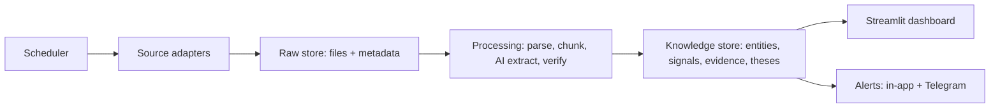

# Architecture

How Mosaic India's parts fit together. Updated at the end of every milestone.

**Status: Milestone 0 (Foundation) complete.** The skeleton, settings, database and an
empty dashboard exist. Nothing fetches data or calls AI yet.

## The big picture (from the brief, Section 8)

In M0 only the **knowledge store** (empty database) and the **dashboard** exist.

## What happens when you run `start.py`

1. **Python check.** It stops with a plain-English message if Python is older than 3.11.
2. **Private package folder.** It creates `.venv/` in the project and installs
   `requirements.txt` into it. It only reinstalls when `requirements.txt` changes (a fingerprint
   is stored in `.venv/mosaic-requirements.sha256`). This keeps the app separate from other
   Python software on the computer and avoids the macOS "externally managed environment" error.
3. **Relaunch.** It runs itself again using the `.venv` Python.
4. **Keys file.** It copies `.env.example` to `.env` if `.env` doesn't exist. It never
   overwrites an existing `.env`.
5. **Settings and database.** It loads `config.yaml`, then creates `data/mosaic.db` and
   `data/raw/` if missing. This is safe to repeat.
6. **Dashboard.** It starts Streamlit (`streamlit_app.py`) in the background on the first free port from 8501,
   waits until it answers, then opens the browser. Streamlit's own output goes to
   `logs/dashboard.log`.

Any failure becomes a **PROBLEM / WHAT TO DO** message.

## Streamlit entrypoint (works with or without `start.py`)

`streamlit_app.py` is the one Streamlit entrypoint. It's used by `start.py`, by a plain
`streamlit run streamlit_app.py`, and by Streamlit Community Cloud.

1. It sets up the page and styling.
2. It calls `app/bootstrap.ensure_ready()`, which loads `.env` if present, sets up logging and
   creates the database. This is cached with `st.cache_resource`, so it runs once per database.
3. It registers pages with `st.navigation`. Each screen is a file in `app/ui/`, and new screens
   are added to the `pages` list.
4. It draws the footer.

**Keys:** `app/keys.get_key(name)` reads the environment and `.env` first, then Streamlit
secrets (`.streamlit/secrets.toml` locally, or the Secrets box on Streamlit Cloud). Both
`.env` and `.streamlit/secrets.toml` are git-ignored.

**Streamlit Cloud caveats:**
- Its storage is wiped on restart, which conflicts with point-in-time storage (principle 6).
- A public app would redistribute broker data (Section 12).
- Cloud hosting is out of scope for v1 (Section 3).

So the cloud is for previewing only until the owner decides otherwise. Unexpected errors are written to
`logs/startup-error.log` and are never printed as tracebacks.

## Folder map

| Path | Purpose | Status |
|---|---|---|
| `start.py` | The one start command | Built |
| `streamlit_app.py` | Streamlit entrypoint and page navigation | Built |
| `app/bootstrap.py` | First-load setup: `.env`, logging, database | Built |
| `app/keys.py` | Reads keys from `.env` or Streamlit secrets | Built |
| `.streamlit/secrets.toml.example` | Key placeholders for Streamlit Cloud | Placeholders |
| `config.yaml` | Models, schedules, rate limits, watchlist (no secrets) | Empty slots |
| `.env.example` → `.env` | API keys, only ever in `.env` (git-ignored) | Placeholders |
| `app/paths.py` | Where files live (tests can redirect via `MOSAIC_*` env vars) | Built |
| `app/errors.py` | `FriendlyError`, `explain()`, rotating log files, key redaction | Built |
| `app/config.py` | Loads and checks `config.yaml` | Built |
| `app/store/db.py` | Creates the 13 tables | Built |
| `app/services/status.py` | Setup checks shown on the home page | Built |
| `app/ui/Home.py`, `app/ui/common.py` | Command Center page, shared styling and footer | Empty dashboard |
| `app/adapters/` | One file per data source | M1+ |
| `app/processing/` | Parse, chunk, extract, verify | M3 |
| `app/llm/` | Groq and Gemini clients, versioned prompts | M3 |
| `data/raw/` | Original documents, never modified (git-ignored) | Empty |
| `data/mosaic.db` | SQLite database (git-ignored) | Created on start |
| `logs/` | `mosaic.log` (rotating), `dashboard.log`, `install.log`, `startup-error.log` | Created on start |
| `tests/` | pytest suite; `tests/golden/` holds the M3 golden set | 31 tests |
| `.streamlit/config.toml` | Dark theme, no usage stats, no error details on screen | Built |

## Database (brief Section 9)

SQLite in WAL mode, created by `app/store/db.py`. Schema version is 1, stored in `PRAGMA user_version`.

- **13 tables:** companies, relationships, people, watchlist, prices, documents,
  passages, signals, theses, claims, evidence, alerts and audit_log.
- **`created_at` (UTC)** on every row.
- **Companies are keyed by ISIN.**
- **Append-only:** `documents`, `passages`, `prices` and `audit_log` have database triggers
  that refuse any UPDATE or DELETE. A changed document is stored as a new row with a higher
  `version`. This enforces principle 6 (point-in-time storage).
- **Lineage is enforced by foreign keys:** a passage must point to a real document, a
  signal to a real passage, and a relationship to a real passage.
- **Three small additions to the brief's field list:**
  - `prices.fetched_at`, for freshness (principle 5).
  - `documents.licence`, for source licence tagging (Section 12).
  - `signals.signal_date`, because Section 5 says each signal records a date.
- **Deferred:** FTS5 full-text search (M5). Signal re-verification history is also deferred
  to M3, where it will be designed as appended status records rather than in-place edits.

## Error handling rule

- **UI code** wraps page content in `try/except`, then calls `show_error(report(exc))`. The
  full detail goes to `logs/mosaic.log` and a plain-English message goes on screen.
- **Log redaction:** any environment variable whose name contains KEY, TOKEN, SECRET, PIN
  or PASSWORD has its value replaced with `[REDACTED]` in the logs.
