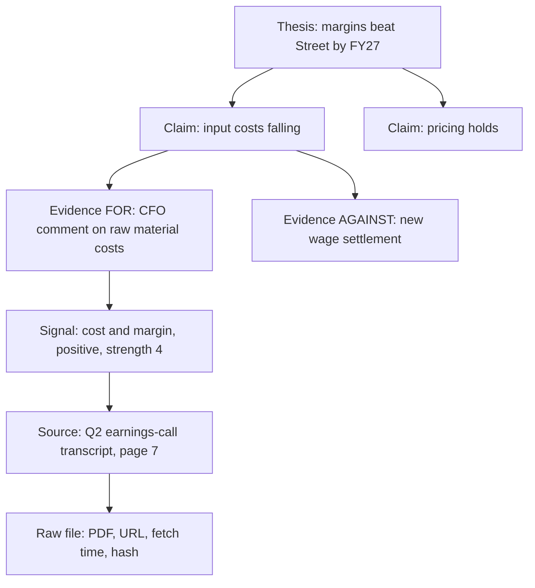
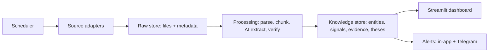

# Mosaic India — Product Brief for Claude Code

Sep 26, 2026 · @Khanna Studios

> Transcribed from the owner's PDF brief. This file is the source of truth for the project.
>
> **v1.1 (25 Sep 2026):** Section 14 was added with the owner's approval. It lists ideas adopted from five reference projects, placed into the milestones in Section 10.

## 1. Project summary

Mosaic India is a personal, zero-cost research platform that collects public signals on Indian listed companies, extracts evidence with AI, and links every conclusion back to its original source.

The core question it answers: **"For this stock, what does the evidence say, where does it disagree with the market's view, and exactly where did each piece come from?"**

It is inspired by institutional systems. From Palantir Foundry it borrows an ontology (companies, people, suppliers and their links) and data lineage. From BlackRock Aladdin it borrows one consistent "book of record" for all entities. It is not a trading system and places no orders.

**Owner profile:** a non-technical user with intermediate finance knowledge. Claude Code writes all code. Every setup step must be explained in plain English, and the app must run with one command.

### Goals for version 1

1. Track a personal watchlist of 10–50 NSE/BSE companies.
2. Ingest free, official data automatically on a schedule: prices, exchange filings, earnings-call transcripts, shareholding, insider and bulk deals, news and macro data.
3. Use Groq and Gemini to summarize documents and extract signals, with every extracted fact verified against its source text.
4. Let the user build a thesis from claims and evidence, see supporting and contradicting evidence side by side, and set kill criteria.
5. Keep a full, replayable audit trail of what the system knew and when.

## 2. Non-negotiable principles

These rules override every feature request. If a feature conflicts with them, stop and flag it to the owner.

1. **The AI never supplies facts.** Every number, date, name and quote comes from ingested source data. The AI only reads, extracts, classifies and summarizes what is already stored.
2. **Every claim is traceable.** Each fact on screen links to its source document, the exact passage, the fetch time and the processing steps applied.
3. **Verify before display.** AI output is checked by code before it is saved. Quotes must exist verbatim in the source. Numbers must appear in the cited passage.
4. **"Unknown" is a valid answer.** The system shows "insufficient evidence" rather than guessing. Empty states are better than invented content.
5. **Show freshness everywhere.** Every data point displays its source timestamp and its fetch timestamp. Stale data is visibly marked.
6. **Point-in-time storage.** Raw data is never overwritten. New versions are appended, so the user can replay what was known on any past date.
7. **Contradictions are first-class.** Evidence against a thesis is shown as prominently as evidence for it.
8. **Official sources outrank secondary sources.** Exchange filings beat news articles. News beats blogs. Conflicts between sources are flagged, never silently resolved.

*Note for the owner: no system can guarantee zero AI errors. This design makes errors rare, detectable and traceable, which is how institutional systems handle the same problem.*

## 3. Scope and constraints

Version 1 is a single-user app that runs on the owner's own computer, costs nothing, and covers Indian equities only.

| Area | In scope (v1) | Out of scope (v1) |
|---|---|---|
| Users | One person, local machine | Logins, teams, clients, cloud hosting |
| Markets | NSE and BSE listed equities | F&O analytics, commodities, currency, global stocks |
| Cost | Free tiers and free public data only | Paid data vendors, paid APIs |
| AI | Groq and Gemini free tiers | Paid LLMs, fine-tuning |
| Actions | Research, alerts, notes | Placing trades, investment advice |
| Platform | Windows or macOS laptop, Python | Mobile app |

Owner constraints Claude Code must respect:

- The owner cannot debug code. Errors must show plain-English messages with a suggested fix.
- Setup must be a short checklist: install Python, copy `.env.example` to `.env`, paste API keys, run one start command.
- All API keys live only in `.env`, never in code, logs or the database.
- Free-tier rate limits must be respected automatically, with queuing and retries rather than crashes.

## 4. Data sources

All v1 sources are free and public; official exchange and regulator data is the backbone, and news is supporting context only.

| Source | What it provides | Access method | Refresh | Trust tier |
|---|---|---|---|---|
| Angel One SmartAPI | Live prices (LTP, OHLC, depth), historical candles | Official API; free with an Angel One account, needs API key + TOTP | Live in market hours (09:15–15:30 IST) | 1 |
| yfinance (`.NS` / `.BO` tickers) | Delayed and end-of-day prices, fallback | Unofficial Python library | Every 15 min + daily close | 2 |
| BSE / NSE corporate announcements | Results, board meetings, investor presentations, earnings-call transcripts, orders won, rating changes | Exchange websites and public endpoints | Every 15 min in market hours, hourly otherwise | 1 |
| Shareholding patterns | Promoter, FII, DII, public holdings and promoter pledges | Exchange filings | Quarterly, checked daily | 1 |
| Insider trading (SEBI PIT) and SAST disclosures | Promoter and insider buying or selling | Exchange filings | Daily | 1 |
| Bulk and block deals | Large institutional trades | Exchange daily reports | Daily after close | 1 |
| FII / DII daily activity | Net institutional flows in cash market | NSE daily report | Daily after close | 1 |
| XBRL financial results | Structured quarterly P&L and balance sheet | Exchange filings | Quarterly | 1 |
| AMFI mutual fund portfolios | Which funds hold which stocks | AMFI monthly disclosures | Monthly | 1 |
| Macro: RBI DBIE, MOSPI, PIB | Repo rate, CPI, IIP, GDP, GST collections | Official sites and downloads | Monthly | 1 |
| Company monthly business updates | Auto sales, cement volumes, bank deposit and loan growth | Exchange filings | Monthly | 1 |
| Credit rating releases (CRISIL, ICRA, CARE) | Rating actions and rationale | Public press releases | Daily | 1 |
| News RSS (ET Markets, Business Standard, Livemint, Google News) | Headlines, links, short snippets | RSS feeds only | Every 30 min | 3 |

Rules for ingestion:

- Store every raw document (PDF, HTML, JSON) with its URL, publish time, fetch time and a content hash before any processing.
- Wrap each source in its own adapter module with a health check. Community libraries such as `nselib`, `jugaad-data` and `bsedata` are unofficial and can break without notice.
- Scrape politely: identify a user agent, cache responses, rate-limit to a few requests per second at most, and back off on errors.
- Do not scrape sites whose terms forbid it (for example Screener.in, Naukri, LinkedIn). Job-posting and patent signals are deferred to v2.
- For news, store only headline, link, date and snippet. Never store or redistribute full articles.
- Verify the current terms, pricing and endpoints of every source during the build, because these change often.

**Known gap: consensus estimates.** There is no reliable free source for Indian analyst consensus. v1 provides a manual "Street view" field per company, plus a tracker of management's own guidance from filings and transcripts.

## 5. Features

Version 1 has ten screens, built in the order listed in section 10.

| # | Screen | What it does |
|---|---|---|
| 1 | Command Center (home) | Watchlist cards with price, day change, newest signal and a freshness badge; top 20 new signals; data health summary |
| 2 | Company page | Price chart, filings timeline, shareholding trend, pledges, insider and bulk deals, AI document summaries with citations, management guidance tracker |
| 3 | Signal Feed | One stream of all extracted signals, filterable by company, type, direction, source tier and date |
| 4 | Thesis Builder | Write a thesis, attach claims and evidence (for and against), set horizon and kill criteria, compare "my view" with "Street view" |
| 5 | Evidence Board | Visual map of thesis → claims → evidence → sources; click any node to see the source passage |
| 6 | Document Viewer | Original filing or transcript with cited passages highlighted |
| 7 | Ask My Research | Questions answered only from stored documents, with citations; replies "not found in my data" otherwise |
| 8 | Alerts | Rules such as new filing, pledge increase, insider selling, price move, kill criterion hit; in-app plus optional free Telegram bot |
| 9 | Time Machine and Audit Log | Replay the evidence as of any past date; log of every ingestion, AI call and user edit |
| 10 | Data Health | Status, last success and error count for each source adapter and each AI provider |

### Signal types to extract

Each signal records type, direction (positive, negative, neutral), strength (1–5), company, date, source link and exact passage.

| Signal type | Example | Why it matters |
|---|---|---|
| Management guidance | "FY27 margin guidance raised to 18–20%" | Direct view of expected earnings |
| Demand commentary | "Order book at record level" | Early read on revenue |
| Cost and margin | "Raw material costs eased this quarter" | Margin direction |
| Capex and expansion | "New plant commissioning in Q3" | Future capacity |
| Governance red flag | Auditor resignation, related-party deal, pledge increase | Risk that overrides good numbers |
| Ownership change | Promoter buying, FII stake rising, MF new entry | Informed money moving |
| Order win or contract | Large order announced to exchange | Revenue visibility |
| Credit rating action | Upgrade, downgrade, outlook change | Balance-sheet health |
| Regulatory or legal | SEBI order, tax demand, litigation | Downside risk |
| Tone shift | Management language more cautious than last quarter | Soft, early signal (marked low reliability) |

### Thesis confidence

Confidence is a transparent score, never a black box. Each piece of evidence gets a weight from source tier, directness to the claim, recency and user rating. The screen shows the formula and every input, and the user can override any weight.

## 6. AI layer and anti-hallucination pipeline

Groq does fast first-pass extraction, Gemini handles long documents and independently checks Groq's work, and plain code has the final say on what gets saved.

### Provider roles

| Task | Primary | Fallback | Why |
|---|---|---|---|
| Signal extraction from filings and news | Groq | Gemini | Fast, good at structured JSON |
| Long document summaries (transcripts, annual reports) | Gemini | Groq, chunked | Long context window, reads PDFs |
| Verification of extracted claims | Gemini | Groq with a different model | A second model catches the first one's errors |
| Ask My Research answers | Gemini | Groq | Grounded answers over retrieved passages |
| Embeddings for search | Local `sentence-transformers` model | Gemini embeddings | Free, offline, no rate limits |

Model names, temperatures and rate limits live in `config.yaml`, never in code, because free-tier models change. Gemini's free tier may use inputs to improve Google's products, so only public data is sent to it; the owner's private thesis notes are not.

### The pipeline, step by step

1. **Chunk.** Split each document into passages, keeping page number and character offsets.
2. **Extract.** Temperature 0, strict JSON schema. Every item must include the exact source quote and chunk ID. The prompt says: if it is not stated in the text, return nothing.
3. **Validate in code.** Reject the item if the JSON is invalid, the quote is not found verbatim in the chunk, any number in the claim is missing from the quote, or the company cannot be matched.
4. **Cross-check.** Gemini is asked only "Does this passage support this claim? Yes, partly or no?" Disagreement marks the item "Needs review".
5. **Label.** Each item gets one status: Verified (passed code and cross-check), Unverified (passed code only), or Rejected (kept in a log, never shown as fact).
6. **Summarize with citations.** Every summary sentence carries a chunk citation. Sentences without a valid citation are removed, and the summary shows its citation coverage.
7. **Answer questions from retrieval only.** Q&A searches stored passages first. If no passage scores above a threshold, the answer is "not found in my data".
8. **Keep numbers out of the AI.** Prices, ratios and financials are read from structured data and displayed by code, never retyped by a model.
9. **Log every call.** Provider, model, prompt version, input hash, output, validation result and time.

### Updating knowledge

The models' own training knowledge is never used as a source. The platform's knowledge is the database, refreshed by scheduled jobs (section 4). A company page is therefore only as current as its last successful fetch, which is always displayed.

### Quality measurement

Claude Code builds a golden test set of 20 filings and transcripts with hand-checked expected signals. Every prompt change is scored on it. Target: at least 95% of Verified items are correct, and 0 fabricated quotes.

## 7. Traceability model

Every conclusion in the app sits at the top of a six-level chain, and the user can click down from any level to the raw source or up from any source to every thesis it affects.



| Level | What it stores | Required links |
|---|---|---|
| Thesis | Statement, horizon, my view, Street view, kill criteria, status | One or more claims |
| Claim | A testable statement that supports the thesis | Evidence for and against |
| Evidence | A signal attached to a claim, with direction and user weight | Exactly one signal |
| Signal | Extracted fact, type, strength, verification status | Exactly one source passage |
| Source passage | Exact quote, page, character offsets | One document |
| Raw document | Original file, URL, publish time, fetch time, content hash | None (the root) |

**Lineage rules:** a signal cannot exist without a passage, and a passage cannot exist without a raw document. If a source document is updated, the new version is stored alongside the old, and affected signals are flagged for re-verification.

## 8. Architecture and tech stack

The app is a single Python project with five layers, a local SQLite database and a background scheduler, started together by one command.



| Layer | Technology | Notes |
|---|---|---|
| Language | Python 3.11+ | One language for everything, easiest for Claude Code to maintain |
| Dashboard | Streamlit + Plotly | Pure Python UI; dark, dense, institutional styling via custom CSS. Final choice for v1; a React front end is a v2 option once the core is stable |
| Evidence graph | `streamlit-agraph` or `pyvis` | Clickable thesis chain |
| Database | SQLite (WAL mode) with FTS5 full-text search | One file, no server, easy backup |
| Vector search | ChromaDB (local) | Semantic search over passages |
| Raw file store | `data/raw/<source>/<date>/` on disk | Original PDFs and JSON, never modified |
| Scheduler | APScheduler | Market-hours aware (IST, NSE holiday calendar) |
| PDF parsing | PyMuPDF, `pdfplumber` fallback | Keeps page numbers for citations |
| Data validation | Pydantic | Every AI output parsed against a schema |
| AI clients | `groq` and `google-genai` SDKs behind one `LLMClient` interface | Swap providers and models via config |
| Alerts | `python-telegram-bot` (optional) | Free push notifications |
| Tests | pytest | Unit tests plus the golden AI test set |
| Logging | Python `logging` to rotating files | Plain-English errors on screen, details in logs |

### Folder structure

```
mosaic-india/
  README.md            # plain-English setup and daily use
  PRODUCT_BRIEF.md     # this document
  .env.example         # API key placeholders
  config.yaml          # models, schedules, rate limits, watchlist
  start.py             # one command: launches scheduler + dashboard
  app/
    adapters/          # one file per data source
    processing/        # parsing, chunking, extraction, verification
    llm/               # Groq and Gemini clients, prompts (versioned)
    store/             # database models and queries
    services/          # thesis, signals, alerts, search logic
    ui/                # Streamlit pages
  data/
    raw/               # original documents
    mosaic.db          # SQLite database
  tests/
    golden/            # hand-checked test documents
```

The business logic sits in `services/`, not in the UI. That keeps an upgrade path open to a React front end or a hosted version later without rewriting the core.

## 9. Data model

Thirteen core tables hold the ontology, the evidence chain and the audit trail; every row carries `created_at`, and nothing factual is ever updated in place.

| Table | Key fields | Purpose |
|---|---|---|
| companies | ISIN (primary key), NSE symbol, BSE code, name, aliases, sector, industry | One canonical entity per company |
| relationships | company_a, company_b, type (supplier, customer, subsidiary, competitor), source_passage_id | The ontology links, each with a source |
| people | name, role, company, from_date, to_date | Promoters, directors, key managers |
| watchlist | company, added_on, notes | What the owner tracks |
| prices | company, timestamp, OHLCV, source | Market data |
| documents | id, source, URL, type, company, published_at, fetched_at, content_hash, file_path, version | Raw document register |
| passages | id, document_id, page, char_start, char_end, text | Citable chunks |
| signals | id, company, type, direction, strength, claim_text, passage_id, status, model, prompt_version | Extracted facts |
| theses | id, company, statement, horizon, my_view, street_view, status, kill_criteria | Investment theses |
| claims | id, thesis_id, statement | Testable parts of a thesis |
| evidence | id, claim_id, signal_id, stance (for or against), user_weight, note | Links signals to claims |
| alerts | id, rule, company, triggered_at, signal_id, seen | Alert history |
| audit_log | timestamp, actor (system, AI or user), action, object, before, after | Full audit trail |

Companies are identified by ISIN, because NSE symbols can change after mergers or renames. The app loads the official NSE and BSE equity lists to map symbols and codes to ISINs.

## 10. Milestones and deliverables

The build runs in seven milestones; each one must work end to end and be demonstrated to the owner before the next begins.

| Milestone | Deliverable | Done when the owner can… |
|---|---|---|
| M0 Foundation | Project skeleton, `.env.example`, `config.yaml`, database, `start.py`, README setup guide | Run one command and see an empty dashboard |
| M1 Companies and prices | NSE/BSE company master, watchlist, Angel One and yfinance price adapters, Command Center, Data Health page. v1.1: Known/Unknown/N.A. values (14.1), four timestamps (14.2), two-part freshness and quality score (14.3), exact-ID company matching (14.4), source registry test (14.12) | Add 10 stocks and see live or delayed prices with timestamps |
| M2 Filings ingestion | BSE/NSE announcements, shareholding, insider, bulk deals, raw store, Document Viewer, company timeline. v1.1: corrections and superseded filings (14.5), exact numbers and cross-source conflicts (14.6) | Open a company and read its latest filings from the original PDFs |
| M3 AI extraction | Groq and Gemini clients, chunking, extraction, code validation, cross-check, Signal Feed, golden test set. v1.1: company-match review queue (14.4), numbers in signals checked with exact decimal maths (14.6), claim type on every signal (14.15) | See verified signals, each opening the exact highlighted passage |
| M4 Thesis and evidence | Thesis Builder, Evidence Board, transparent confidence score, kill criteria. v1.1: one rule format (14.7), red-flag checklist, pre-mortem, A/B/C grade (14.8), contradiction flags (14.9), named audited actions (14.11), thesis states and refresh conditions (14.16), "Needs your review" inbox (14.17), event expectations setup (14.18) | Build a thesis with evidence for and against and see its source chain |
| M5 Search and Q&A | Full-text and semantic search, Ask My Research with citations | Ask a question and get a cited answer or "not found in my data" |
| M6 Alerts and audit | Alert rules, Telegram bot, Time Machine, audit log, macro and news adapters. v1.1: alerts use the 14.7 rule format, thesis drift labels (14.10), event before/after comparison (14.18) | Get an alert for a new filing and replay last month's evidence |

### Final deliverables

- Working local app started by `python start.py`.
- Full source code in a Git repository with clear commit history.
- `README.md`: plain-English setup, daily use and troubleshooting.
- `ARCHITECTURE.md`: how the parts fit, kept up to date.
- `DATA_SOURCES.md`: every source, its terms, refresh schedule and known limits.
- Automated tests, including the golden AI test set and its latest score.
- A backup script that copies `mosaic.db` and `data/raw/` to a dated folder.

## 11. Acceptance criteria and tests

The prototype is accepted only when every check below passes on the owner's machine.

- Fresh install works by following the README alone, with no coding.
- Every signal, summary sentence and Q&A answer opens its exact source passage in one click.
- Zero fabricated quotes on the golden test set; at least 95% of Verified signals are correct.
- A question with no answer in the data returns "not found in my data", tested with 10 such questions.
- Every price and data point shows source and timestamp; data older than its refresh window shows a "stale" badge.
- Turning off the internet, a bad API key or a rate limit produces a plain-English message, not a crash.
- Time Machine shows the evidence board exactly as it stood on a chosen past date.
- No API key appears in code, logs, database or Git history.
- Data Health shows every adapter's last success and error count.
- Unit tests cover the validation rules in section 6, step 3, and all pass.
- *(v1.1)* No displayed field is blank or zero when its value is unknown; it shows "Unknown" with a reason (14.1).
- *(v1.1)* Every alert, kill-criterion and red-flag rule has passing test examples (14.7).
- *(v1.1)* A cross-source number conflict is shown with every source's value and is never silently resolved (14.6).
- *(v1.1)* The code never contacts an internet host that isn't listed in `DATA_SOURCES.md` (14.12).
- *(v1.1)* Every signal shows its claim type; a company claim is never displayed as a fact (14.15).
- *(v1.1)* Every thesis state change links to evidence and is in the audit log (14.16).

## 12. Legal, compliance and known limitations

The platform is for personal research on public information only; sharing it with others or selling insights later would bring SEBI and data-licensing rules into play.

Compliance rules built into the app:

- Only public information is ingested. The app never stores or processes material non-public information (MNPI). A manual note field warns the user not to record tips or inside information.
- Each document is tagged with its source type and licence terms. Exchange market data from broker APIs is for the account holder's personal use and must not be redistributed.
- Every screen carries a footer: "Personal research tool. Not investment advice."
- If the owner later shares research publicly or with paying users, SEBI rules on research analysts and investment advisers may apply. Get professional advice before that step.

Known limitations of v1:

| Limitation | Effect | Mitigation |
|---|---|---|
| No free consensus estimates | Edge versus Street is partly manual | Manual Street view field, management guidance tracker |
| Unofficial exchange endpoints | Adapters can break when NSE or BSE change their sites | Health checks, alerts on failure, fallback sources |
| Free-tier AI rate limits | Large backlogs process slowly | Queue, prioritise watchlist companies, cache results |
| Scanned PDFs without text | Extraction may fail | OCR fallback, flagged as lower confidence |
| Real-time prices need an Angel One account | Without it, prices are delayed | yfinance fallback, clearly labelled "delayed" |
| AI can still misread context | A verified quote may be interpreted wrongly | Cross-check, user review, transparent confidence |

## 13. Working instructions for Claude Code

Claude Code should treat this brief as the source of truth, build one milestone at a time, and explain every step to a non-technical owner.

1. Save this brief as `PRODUCT_BRIEF.md` in the project root. Create a `CLAUDE.md` that summarises section 2 and points to this file.
2. Before writing code for a milestone, show a short plan in plain English and wait for the owner's approval.
3. Build only the current milestone. Do not add features outside this brief without asking.
4. After each milestone, run the tests, then give the owner a numbered list of what to click to confirm it works.
5. Verify every data source's current endpoint, terms and free-tier limits before writing its adapter. If a source is paid, blocked or forbids access, stop and propose a free alternative.
6. Never invent data, sample values or fake API responses in the running app. Test fixtures are allowed only inside `tests/` and must be labelled as fixtures.
7. When the owner reports a problem, ask for the on-screen message and the last lines of the log file, then fix the cause and explain it simply.
8. Keep `README.md`, `ARCHITECTURE.md` and `DATA_SOURCES.md` updated at the end of every milestone.
9. Commit to Git after each working step with a clear message, so any change can be undone.
10. If any instruction here conflicts with section 2, section 2 wins. Flag the conflict to the owner.

## 14. Enhancements adopted after reference review (v1.1)

*Added 25 Sep 2026 with the owner's approval, after reviewing six open-source projects:
OpenFoundry, worldmonitor, Akashic, ontology-platform, ai-berkshire and Mira (14.15–14.18). No code is copied
from them; only ideas are adopted. worldmonitor and Akashic are AGPL-licensed, so their
code must not be copied. Section 2 still overrides everything here.*

Where several projects solved the same problem, one design was chosen. The reason is given
under **Why this one**.

### 14.1 Every value is Known, Unknown or Not applicable (M1 onward)

Every data field the app displays or scores is in exactly one state:

| State | Rule |
|---|---|
| **Known** | Has a value and a source. |
| **Unknown** | The field applies but has no value yet. It must carry a short reason (for example "source not fetched yet" or "not disclosed in filing"). It can never have a value. |
| **Not applicable** | The field doesn't apply (for example pledges for a company with no promoter). It must carry a reason. |

An unknown value is never shown as blank, zero, "OK" or green. This puts Principle 4 into
the data model.

*Why this one:* worldmonitor's contract makes "unknown" explicit and requires a reason. Akashic
and ai-berkshire leave gaps implicit. Only the explicit version can be tested automatically.

### 14.2 Four separate timestamps (M1 onward)

Section 2 asks for a source time and a fetch time. The source time is split in two, so
four times are kept wherever the source provides them:

- **event time**: when the thing happened, e.g. the board meeting or the trade
- **effective time**: when it takes effect, e.g. a record date or a rating's effective date
- **published time**: when the exchange or publisher released it
- **fetched time**: when this app downloaded it

Each time is stored separately and never substituted for another. A time the source
doesn't give is **Unknown** (14.1), not copied from another field. Freshness badges use
published and fetched time.

*Why this one:* only worldmonitor separates these. It matters in India because companies
often file results or deal disclosures days after the event, and a single date hides that
delay.

### 14.3 Two-part freshness and a source quality score (M1 Data Health)

Every source adapter reports two things separately. They are never merged into one
green/red badge.

1. **Fetch status**: `ok`, `stale`, `missing`, `blocked`, `timeout` or `error`. "Blocked by
   the website" is never shown as "no new filings".
2. **Content age**: `current`, `stale`, `partial` or `timestamp unknown`. A successful fetch
   can still return old content.

Each adapter also gets a **quality score (0–100)** calculated by a formula that is shown on
the Data Health page:

`40% × fetch success rate (last 7 days) + 30% × content freshness + 30% × validation pass rate`

Every past score is kept, so trends are visible.

*Why this one:* worldmonitor's two-part freshness and Akashic's separate failure states are
combined into one list. OpenFoundry's quality score is adopted, but its formula measured
database completeness, which doesn't suit data feeds. The inputs are replaced with ones
that measure a feed's health.

### 14.4 Company matching: exact IDs first, never automatic fuzzy matches (M1, M3)

Linking a filing, deal or news item to a company follows this order:

1. **ISIN**, if the source provides it.
2. Exact **NSE symbol or BSE code**, looked up in the official lists.
3. Exact match against the company's **known names and aliases**.
4. Fuzzy name matching, used only to *suggest* a match. Fuzzy suggestions go to a
   **"Needs review"** queue and are never saved as fact until the owner confirms. An
   unmatched item stays unlinked, which counts as "company cannot be matched" in Section 6,
   step 3.

*Why this one:* Akashic's "exact ID first, fuzzy second" order is adopted. Its automatic
acceptance of fuzzy matches is rejected, because it would break Principle 3.

### 14.5 Corrections and superseded filings (M2)

A document can be marked **original**, **revised**, **corrected**, **cancelled** or
**superseded**, with a link to the document that replaces it. The old version stays stored
(Principle 6). The Document Viewer shows a banner such as "Superseded by <newer filing>".
Signals from a superseded document are automatically marked for re-verification (Section 7).

*Why this one:* only worldmonitor models this. Indian filers often issue revised results,
corrigenda and clarifications, and a plain version number can't say which one is current.

### 14.6 Exact numbers and cross-source checks (M2, M3)

- All money, ratio and percentage calculations use exact decimal maths (Python `Decimal`),
  never floating-point maths.
- Numbers are stored with their original text as it appeared in the source, plus the
  parsed value.
- Built-in checks such as market cap = price × shares recalculate figures and flag any
  mismatch.
- When two sources report the same figure and differ by more than a set tolerance (in
  `config.yaml`), a **conflict** is recorded:
  - The value from the **highest-trust source** is displayed, with a visible conflict badge.
  - The badge lists every source and its value.
  - The conflict stays open until the owner reviews it.

*Why this one:* ai-berkshire's exact-maths and cross-check tools are adopted. Its habit of
settling disagreements with a "median consensus" is rejected, because Principle 8 says
conflicts are flagged and never silently resolved. ai-berkshire's Benford-law fraud test is
not adopted. It needs hundreds of figures, but a company has only a few dozen quarterly
figures, so it would produce misleading results.

### 14.7 One rule format for alerts, kill criteria, red flags and data checks (M4, M6)

The brief needs rules in four places:
- alerts (Section 5, screen 8)
- thesis kill criteria (Section 5, screen 4)
- the red-flag checklist (14.8)
- data-quality checks (14.3)

They all use **one rule format**, stored as readable YAML files in `rules/`. Each rule has:

- `id`, `name`, `severity` (critical, warning or info)
- `when`: a declarative condition. It may only use functions from an approved list, such as
  `pledge_change(company, quarters=1)`, `insider_net_sell(company, days=30)`,
  `signal_exists(company, type, direction, days)` or `price_change(company, days)`. No free
  code is allowed.
- `message`: a plain-English sentence filled from the matching data, e.g. "Promoter pledge
  rose from 4.1% to 9.8% (shareholding filing, 12 Aug)".
- `explanation` and `references`: why the rule matters.
- `tests`: example inputs that must trigger the rule and must not. These run in pytest, like
  the golden set.
- Thresholds live in a **governed thresholds table** in `config.yaml`, so they can be
  changed without code.

The app shows every rule as a plain-English sentence. Every alert links to the exact data
and source that triggered it.

*Why this one:* ontology-platform's rule format is the most readable and the only one with
built-in test examples. OpenFoundry's quality rules and ai-berkshire's veto checklist were
simpler designs for the same problem, so one engine replaces three.

### 14.8 Thesis discipline tools (M4 Thesis Builder)

Adapted from ai-berkshire, with one change: every item must be backed by evidence.

- **Red-flag checklist.** Each company is checked against red flags. Some can be checked
  automatically by rules (14.7), such as:
  - promoter pledge rising
  - auditor resignation signal
  - negative operating cash flow for 3 years, from XBRL data
  - SEBI or legal order signal

  Others the owner answers manually, such as "Can I explain how this company makes money?".
  A triggered flag shows its evidence. A flag with no data shows "insufficient evidence",
  never "passed".
- **Pre-mortem.** The Thesis Builder has a required "How could this thesis fail?" list. Each
  item can become a kill criterion (a 14.7 rule).
- **Evidence coverage grade (A/B/C).** A transparent label computed by a published formula:
  - **A**: at least 3 Verified tier-1 signals *and* at least 1 against-evidence item reviewed
  - **B**: at least 1 Verified tier-1 signal
  - **C**: everything else

  It measures *how much evidence exists*, not whether the thesis is right, and sits beside
  the confidence score (Section 5).

*Why this one:* the brief's transparent confidence score is kept as the single confidence
number. Akashic's automatic "truth probability" is rejected: it hides the method and
resolves contradictions silently. ai-berkshire's "master investor" persona scores and
buy/sell price ranges are rejected, because they are investment advice (Sections 3 and 12)
and depend on AI opinion rather than stored evidence (Principle 1).

### 14.9 Contradiction flags (M4)

The app flags a **possible contradiction** when two Verified signals for the same company:
- have the same signal type,
- have opposite directions, and
- fall within a set window (default 180 days, in `config.yaml`).

Both are shown side by side on the Evidence Board for the owner to review. The app never
decides which is right.

*Why this one:* Akashic's idea of flagging contradictions is adopted. Its keyword-based
detector is rejected because it produces many false alarms. The brief's structured signal
type and direction give a precise test instead.

### 14.10 Thesis drift: fact vs price vs no change (M6 Time Machine)

When the owner compares a thesis between two dates, each difference is labelled as one of:

- **Fact change**: new, removed or re-verified evidence, a filing correction (14.5), or a
  kill criterion hit.
- **Price change**: price or valuation moved, but no evidence changed.
- **No change**: nothing material changed.

The comparison uses stored evidence and data, never AI-written wording. A differently
worded summary can't create "drift".

*Why this one:* adopted from ai-berkshire's thesis-drift method. It is made
deterministic by comparing database records as of each date (Principle 6), not two AI
reports.

### 14.11 Named, audited user actions (M4 onward)

Every change the owner makes (add to watchlist, attach evidence, change a weight, confirm
a company match, resolve a conflict) goes through a named action in `app/services/`. Each
action:
- checks its inputs,
- writes an `audit_log` row with the before and after values,
- asks for confirmation if it removes or overrides anything.

*Why this one:* adopted from OpenFoundry's "action types". OpenFoundry's microservice
architecture is rejected, because it would break the one-command local setup.

### 14.12 Source registry stays in sync with the code (M1 onward)

Every internet host an adapter contacts must be listed in `DATA_SOURCES.md` with:
- its trust tier,
- its licence or terms status,
- the date its terms were last checked.

A test fails if the code contacts a host that isn't listed.

*Why this one:* adopted from worldmonitor's auto-generated source attribution, done as a
simpler test.

### 14.15 Claim type on every signal (M3)

"Verified" (Section 6, step 5) proves only that the quote exists in the source. It does not
prove the statement is true. Every signal therefore also records a **claim type**:

| Claim type | Example | How it may be used |
|---|---|---|
| `fact` | Filed quarterly revenue, auditor resignation letter | Can support a claim directly |
| `reported_metric` | Order book, deposit growth in a monthly update | Supports a claim; its definition must be noted |
| `company_claim` | "Demand remains strong" | Management's word only; needs other evidence |
| `guidance` | "FY27 margin 18–20%" | An expectation input, never a delivered fact |
| `target` | "₹10,000 crore revenue by 2030" | Strategic intent or scenario only |
| `commitment` | Signed contract, order with amount and date | Tracked until delivered |
| `forecast` | Rating agency or third-party projection | An expectation, not a fact |
| `opinion` | Analyst or media view quoted in a source | Never supports a claim on its own |
| `market_pricing` | Price move, valuation multiple | Shows what the market prices in, not the fundamentals |

The claim type is set by the extraction step and checked by code where possible; a
number-backed item from structured XBRL data, for example, is `fact`. It is shown
as a badge next to the Verified status. The confidence score (Section 5) and evidence grade
(14.8) weight `fact` and `reported_metric` above `company_claim`, `guidance` and `opinion`,
and the formula shows these weights.

*Why:* this is adopted from Mira's claim taxonomy. It closes a gap where a correctly
quoted management claim could look like a verified fact. Mira's rumour and sentiment types
are not adopted, because v1 doesn't ingest those sources.

### 14.16 Thesis states and refresh conditions (M4)

A thesis has exactly one state:

- `draft`
- `active`
- `watch`
- `upgrade_watch`
- `downgrade_watch`
- `stale`
- `retired`

Every state change is a named, audited action (14.11) that **must link to the evidence
behind it**. Only the owner changes a state. The one exception is automatic `stale`, below.

Each thesis also records:
- **`stale_after`**: for example "after next quarterly results" or a date. After this the
  thesis is automatically marked `stale` until the owner reviews it.
- **`must_refresh_if`**: conditions written as 14.7 rules, such as a new results filing, a
  guidance change or a kill-criterion hit. When one fires, the thesis goes to the review
  inbox (14.17).

*Why:* adopted from Mira's thesis state machine and time policy. It extends Principle 5
(freshness) from data to conclusions.

### 14.17 Monitoring loop as a "Needs your review" inbox (M4)

When new signals are saved (M3 onward), a monitoring pass runs:

1. **Link.** Code finds every thesis claim the new signal may affect, using company, signal
   type and the claim's linked signal types. No AI judgement is used.
2. **Sort.** 14.7 rules place each item in one of three groups:
   - **Could change a thesis**: e.g. a kill-criterion rule fired, or strong opposite-direction
     evidence arrived.
   - **Background**: relevant but minor.
   - **Filtered**: duplicates, or unmatched or low-trust items. These are kept and can be
     viewed; nothing is deleted.
3. **Review.** The Command Center shows a **"Needs your review"** inbox with the source link
   for each item. The owner can:
   - attach it as evidence **for** or **against**,
   - dismiss it (the reason is logged),
   - change the thesis state (14.16, with evidence required).

The loop runs only when new data arrives, never as a continuously running AI. The AI never
decides a thesis's impact or state; it only extracts and labels signals as in Section 6.

*Why:* adopted from Mira's monitoring loop, but run by code and owner decisions. Mira's
agent-run version and its AI-assigned −2…+2 impact score are rejected under Principles 1
and 3.

### 14.18 Event expectations: before vs after (M4 setup, M6 comparison)

- **Before** a known event (results date, board meeting, or an AGM from the filings
  calendar), the app prompts: "Write your expectations". The owner records expected
  direction and key figures per variable (revenue, margin, order book, guidance). The
  record is locked and timestamped, following Principle 6.
- **After** the event's filing is ingested, one screen shows side by side:
  - the owner's locked expectation,
  - the figures actually filed (from structured data, Section 6 step 8),
  - management guidance vs the previous guidance,
  - the price reaction.

  Differences are calculated by code.
- If there is no free consensus, the screen says **"No consensus available"**. It never
  shows an estimate. The owner's Street view field (Section 4, known gap) may be used and
  is labelled as the owner's input.

*Why:* adopted from Mira's event-delta loop. Locking expectations *before* the event stops
hindsight bias, which is the main way personal research fools itself.

### 14.13 Considered and deferred to v2

- **India market mood gauge**, from worldmonitor's Fear & Greed design, e.g. India VIX, FII/DII
  flows and breadth. Deferred until the v1 data sources are stable.
- **Maps and geographic views**, from worldmonitor and Akashic, e.g. plant locations. Not
  needed for v1.
- **Decision-quality review / postmortem** (Mira): separates good reasoning from luck,
  market moves and timing after an outcome. It needs months of history first; the M6 Time
  Machine is its foundation.

### 14.14 Considered and rejected

- **Automatic truth probabilities** (Akashic): break Principles 3 and 8.
- **Looking up people's online profiles** (Akashic "recon"): privacy risk, out of scope.
- **AI web search as a source of facts** (ai-berkshire): breaks Principle 1.
- **Buy/sell recommendations with price ranges** (ai-berkshire): investment advice
  (Sections 3 and 12).
- **Settling conflicts with a median or consensus value** (ai-berkshire): breaks Principle 8.
- **Scraping social or community sites** (ai-berkshire's Xueqiu scraper): Section 4 terms rule.
- **Microservice / Postgres / Rust architecture** (OpenFoundry): breaks the one-command local
  setup.
- **Copying any code from AGPL projects** (worldmonitor, Akashic): licence obligations.
- **AI-assigned thesis impact scores or AI-decided state changes** (Mira): AI judgement, not evidence (Principles 1 and 3).
- **Mira's market-data page reads (Yahoo, StockAnalysis), social-sentiment monitoring and
  sell-side report purchasing**: terms-of-use and paid-source conflicts.
- **Position-sizing implications** (Mira): investment advice (Section 12).
